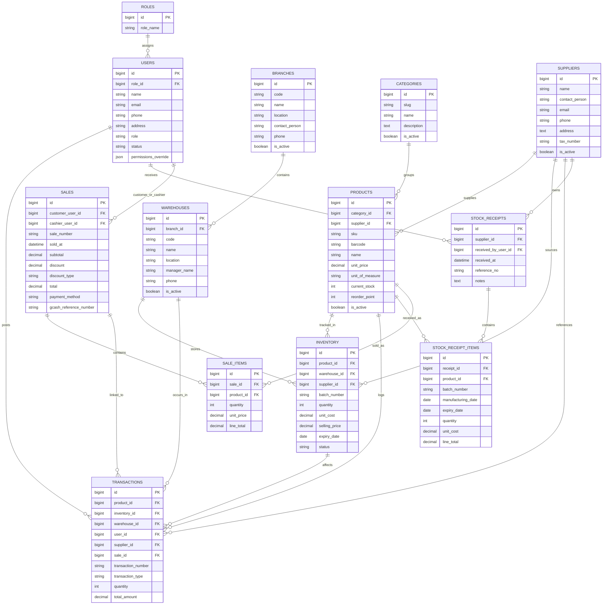
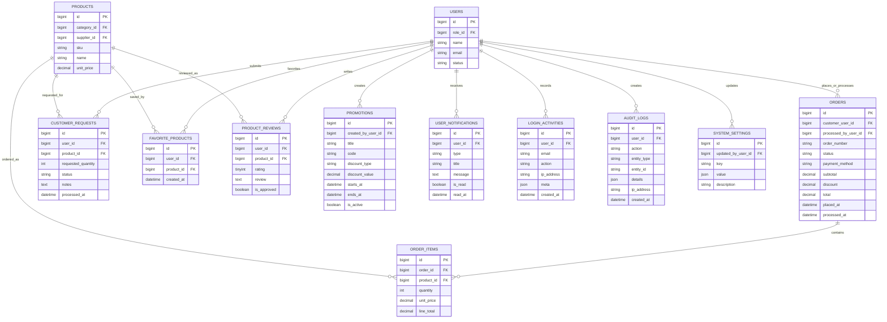

# Farm Supply Inventory System ERD

This ERD was updated from the current Laravel migrations in `database/migrations`.

## Scope

Included:
- core inventory and warehouse operations
- sales and stock receipt flow
- customer ordering and engagement
- governance and audit tables

Omitted for clarity:
- `cache`, `cache_locks`
- `jobs`, `job_batches`, `failed_jobs`
- `password_reset_tokens`, `sessions`
- `personal_access_tokens`
- dropped `sms_messages`

## Core Operations

## Customer, Engagement, and Governance

## Source Migrations

Primary tables were derived from these migrations:
- `0001_01_01_000000_create_users_table.php`
- `2026_02_26_110057_create_categories_table.php`
- `2026_02_26_110058_create_suppliers_table.php`
- `2026_02_26_110058_create_products_table.php`
- `2026_02_26_110059_create_warehouses_table.php`
- `2026_02_26_110059_create_inventory_table.php`
- `2026_02_26_110100_create_transactions_table.php`
- `2026_03_04_000000_create_customer_requests_table.php`
- `2026_03_04_020000_apply_erd_schema_tables.php`
- `2026_03_05_000100_add_gcash_fields_to_sales_table.php`
- `2026_03_05_000200_add_discount_verification_fields_to_sales_table.php`
- `2026_03_05_000300_create_orders_and_engagement_tables.php`
- `2026_03_05_000350_add_profile_and_permission_columns_to_users_table.php`
- `2026_03_05_000400_create_super_admin_system_tables.php`
- `2026_03_05_000500_create_branches_and_sms_messages_tables.php`
- `2026_03_07_000300_add_batch_fields_to_stock_receipt_items_table.php`
